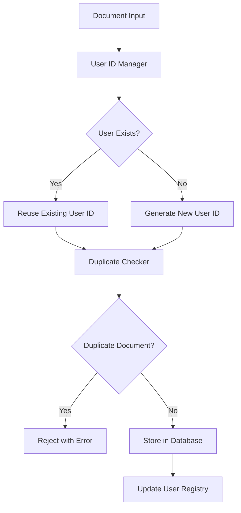

# Design Document

## Overview

This design implements a unique user management system that prevents duplicate Aadhar entries and ensures each user gets only one unique user ID across all database tables. The solution involves database schema modifications, constraint additions, duplicate detection logic, and data migration utilities.

The current system has separate databases for Aadhar (`aadhaar_documents.db`) and PAN (`pan_documents.db`) documents, with no cross-referencing or duplicate prevention mechanisms. This design will unify user management while maintaining document-specific storage.

## Architecture

### High-Level Architecture



### Database Architecture

The system will implement a unified user management approach with the following structure:

1. **Central User Registry**: A new `users` table that maintains unique user IDs
2. **Document-Specific Tables**: Enhanced existing tables with user ID references
3. **Constraint Layer**: Database-level uniqueness constraints
4. **Migration Layer**: Tools to clean existing duplicate data

## Components and Interfaces

### 1. User ID Manager

**Purpose**: Manages unique user ID generation and assignment

**Interface**:
```python
class UserIDManager:
    def get_or_create_user_id(self, aadhaar_number: str, name: str) -> str
    def user_exists(self, aadhaar_number: str) -> bool
    def get_user_by_aadhaar(self, aadhaar_number: str) -> Optional[Dict]
```

**Key Features**:
- UUID-based user ID generation
- Aadhaar-based user lookup
- Thread-safe operations
- Caching for performance

### 2. Duplicate Prevention Service

**Purpose**: Prevents duplicate document entries across all tables

**Interface**:
```python
class DuplicatePreventionService:
    def check_aadhaar_exists(self, aadhaar_number: str) -> bool
    def check_pan_exists(self, pan_number: str) -> bool
    def normalize_aadhaar(self, aadhaar_number: str) -> str
    def normalize_pan(self, pan_number: str) -> str
```

**Key Features**:
- Cross-database duplicate detection
- Number normalization (remove spaces, hyphens)
- Case-insensitive comparison
- Detailed duplicate reporting

### 3. Database Schema Manager

**Purpose**: Manages database schema updates and constraints

**Interface**:
```python
class DatabaseSchemaManager:
    def create_users_table(self) -> None
    def add_unique_constraints(self) -> None
    def migrate_existing_data(self) -> None
    def verify_constraints(self) -> bool
```

**Key Features**:
- Safe schema migrations
- Rollback capabilities
- Constraint validation
- Data integrity checks

### 4. Enhanced Document Extractors

**Purpose**: Modified existing extractors with user management integration

**Changes to AadhaarExtractionTool**:
- Add user ID assignment before storage
- Implement duplicate checking
- Enhanced error handling for constraint violations

**Changes to PANExtractionTool**:
- Add user ID assignment before storage
- Cross-reference with Aadhaar data
- Implement duplicate checking

## Data Models

### New Users Table

```sql
CREATE TABLE users (
    user_id TEXT PRIMARY KEY,           -- UUID format
    aadhaar_number TEXT UNIQUE NOT NULL, -- Normalized Aadhaar
    primary_name TEXT NOT NULL,         -- Primary name from first document
    created_at TEXT DEFAULT CURRENT_TIMESTAMP,
    updated_at TEXT DEFAULT CURRENT_TIMESTAMP,
    document_count INTEGER DEFAULT 0    -- Number of documents for this user
);

CREATE UNIQUE INDEX idx_users_aadhaar ON users(aadhaar_number);
```

### Enhanced Aadhaar Tables

```sql
-- Add user_id column to existing aadhaar_documents table
ALTER TABLE aadhaar_documents ADD COLUMN user_id TEXT;
ALTER TABLE aadhaar_documents ADD CONSTRAINT fk_aadhaar_user 
    FOREIGN KEY (user_id) REFERENCES users(user_id);

-- Add unique constraint on Aadhaar number in extracted_fields
CREATE UNIQUE INDEX idx_aadhaar_unique ON extracted_fields("Aadhaar Number");

-- Add user_id to extracted_fields for consistency
ALTER TABLE extracted_fields ADD COLUMN user_id TEXT;
ALTER TABLE extracted_fields ADD CONSTRAINT fk_aadhaar_fields_user 
    FOREIGN KEY (user_id) REFERENCES users(user_id);
```

### Enhanced PAN Tables

```sql
-- Add user_id column to existing pan_documents table
ALTER TABLE pan_documents ADD COLUMN user_id TEXT;
ALTER TABLE pan_documents ADD CONSTRAINT fk_pan_user 
    FOREIGN KEY (user_id) REFERENCES users(user_id);

-- Add unique constraint on PAN number in extracted_fields
CREATE UNIQUE INDEX idx_pan_unique ON extracted_fields("PAN Number");

-- Add user_id to extracted_fields for consistency
ALTER TABLE extracted_fields ADD COLUMN user_id TEXT;
ALTER TABLE extracted_fields ADD CONSTRAINT fk_pan_fields_user 
    FOREIGN KEY (user_id) REFERENCES users(user_id);
```

### Cross-Reference Table

```sql
CREATE TABLE user_documents (
    id INTEGER PRIMARY KEY AUTOINCREMENT,
    user_id TEXT NOT NULL,
    document_type TEXT NOT NULL,        -- 'AADHAAR' or 'PAN'
    document_id INTEGER NOT NULL,       -- Reference to specific document table
    created_at TEXT DEFAULT CURRENT_TIMESTAMP,
    FOREIGN KEY (user_id) REFERENCES users(user_id),
    UNIQUE(user_id, document_type)      -- One document type per user
);
```

## Error Handling

### Duplicate Detection Errors

```python
class DuplicateAadhaarError(Exception):
    def __init__(self, aadhaar_number: str, existing_user_id: str, existing_document_id: int):
        self.aadhaar_number = aadhaar_number
        self.existing_user_id = existing_user_id
        self.existing_document_id = existing_document_id
        super().__init__(f"Aadhaar {aadhaar_number} already exists for user {existing_user_id}")

class DuplicatePANError(Exception):
    def __init__(self, pan_number: str, existing_user_id: str, existing_document_id: int):
        self.pan_number = pan_number
        self.existing_user_id = existing_user_id
        self.existing_document_id = existing_document_id
        super().__init__(f"PAN {pan_number} already exists for user {existing_user_id}")
```

### Database Constraint Violations

- Handle SQLite UNIQUE constraint violations gracefully
- Provide meaningful error messages to users
- Log all constraint violations for audit purposes
- Implement retry mechanisms for transient errors

### Migration Errors

- Validate data integrity before and after migration
- Provide rollback mechanisms for failed migrations
- Handle partial migration failures
- Generate detailed migration reports

## Testing Strategy

### Unit Tests

1. **User ID Manager Tests**
   - Test UUID generation uniqueness
   - Test user lookup functionality
   - Test caching mechanisms
   - Test thread safety

2. **Duplicate Prevention Tests**
   - Test Aadhaar normalization
   - Test PAN normalization
   - Test duplicate detection accuracy
   - Test cross-database checking

3. **Database Schema Tests**
   - Test constraint creation
   - Test migration scripts
   - Test rollback functionality
   - Test data integrity

### Integration Tests

1. **End-to-End Document Processing**
   - Test complete document processing flow
   - Test duplicate rejection scenarios
   - Test user ID assignment consistency
   - Test cross-document type linking

2. **Database Integration Tests**
   - Test constraint enforcement
   - Test foreign key relationships
   - Test transaction handling
   - Test concurrent access scenarios

### Performance Tests

1. **Load Testing**
   - Test with large datasets
   - Test concurrent document processing
   - Test database performance under load
   - Test memory usage patterns

2. **Migration Performance**
   - Test migration speed with large datasets
   - Test rollback performance
   - Test constraint creation time
   - Test index creation performance

### Data Migration Testing

1. **Pre-Migration Validation**
   - Identify all duplicate records
   - Validate data quality
   - Test backup and restore procedures
   - Test migration script dry-runs

2. **Post-Migration Validation**
   - Verify no data loss
   - Verify constraint enforcement
   - Verify application functionality
   - Verify performance impact

## Implementation Phases

### Phase 1: Database Schema Updates
- Create users table
- Add user_id columns to existing tables
- Create migration scripts
- Implement rollback procedures

### Phase 2: Core Services Implementation
- Implement UserIDManager
- Implement DuplicatePreventionService
- Implement DatabaseSchemaManager
- Add comprehensive error handling

### Phase 3: Extractor Integration
- Modify AadhaarExtractionTool
- Modify PANExtractionTool
- Add duplicate checking to extraction flow
- Update storage procedures

### Phase 4: Data Migration
- Clean existing duplicate data
- Migrate data to new schema
- Apply constraints
- Validate migration success

### Phase 5: Testing and Validation
- Run comprehensive test suite
- Perform load testing
- Validate constraint enforcement
- Document final implementation